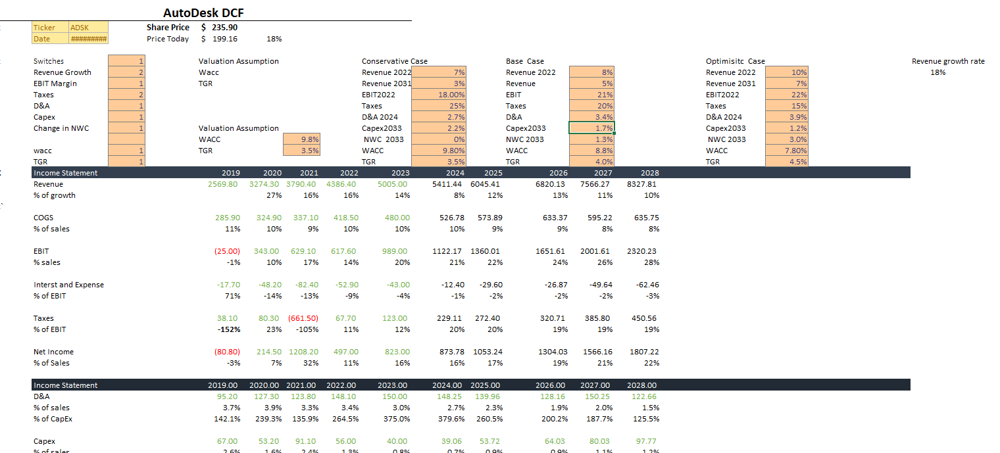

**Project Proposal by Zide Yang**

**Project Overview**
In this project, I would like to use the knowledge we have learned in Python class so far to integrate it with some financial knowledge from finance class. After listening to Professor Li’s instructions, I recognized that it is important to me to solve some problems that I have encountered in my college life during this project. At the same time, I would like to use this project to help other students while they are encountering the same problem as me. Therefore, based on my studying experience and difficulties at Babson, I recognized that doing the DCF template as an entry-level student in Finance would be one of the hardest things in my college career.  I would like to use the opportunity in the final project to help students to have an easier process and instruction while they are doing the Discounting Cash Flow Model.

**Implementation Plan**
First of all, I could think the project has been separated into two stages. The first stage is to design a Discounting Cash Flow Model template from Python. I will use my previous experience with DCF to create a blank template for students to do the DCF model template. This may include some connections between Excel and Python, but I decided to use Python as the programming language to generate the template. On the other hand, I would also like to achieve the input (formula) part from Python. The final idea of this template is for students to put the numbers in the according figures and it will come up with the result automatically. (I may still need to discuss the availability and further improvements area with Professor Li later)

The second part of the project is to build a Python tutorial page through Flask and HTML.page. This may include some wording and step instructions on how to do DCF step by step. I would like to include some pictures and URLs of useful websites or videos that I think would be helpful to users. Furthermore, if I could use or get some API key from a financial website to search or post the result from their official website, I would definitely include that part in my final project. Overall, I would like the website from Flask to include the template of DCF, the program of DCF, and some instructions on how to do the DCF
Project Schedule
Since I am on my own for this project, the project schedule will be determined by myself. Since I have four projects going on in April and I am flying back to my hometown by the end of April, I will heavily compress the progress in the next two weeks from April 10 to April 22, 2023. I will try to finish the template and the program of DCF by the end of April 16 and start to finish the website from April 16- April 22. After that, I will start to optimize and improve the website and programming language until the deadline of the project

**Risk and Limitation**
Well, the main limitation I could think of for this project is that I could not get the API key from the financial website, which will limit part of the function of my website. If I could not use the API directly, I might provide the URL instead. Another limitation of the project would be my creativity on the HTML page. Since I haven’t taken any official web app classes, my website might not look as good as others. But I will try my best to design the UI of the page with the assistance of chatGPT. Lastly, I haven’t tried to use Python to work on Excel before. Therefore, I could imagine that I may encounter some difficulties at the beginning stage. However, other than that I think I am confident to deal with the challenges or difficulties during the project. Good Luck, Zide.
